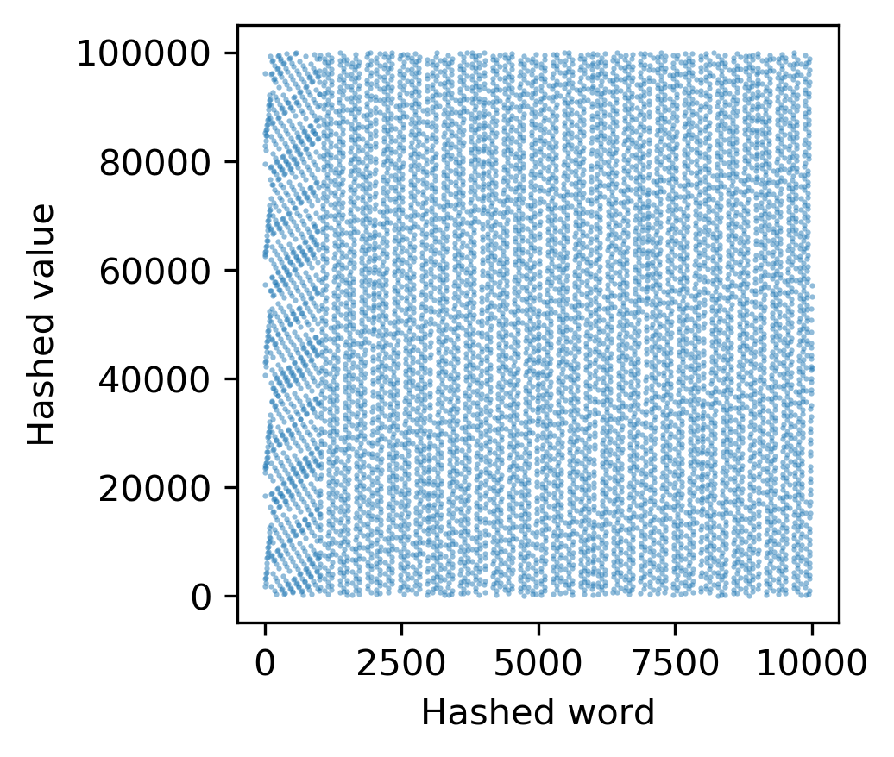
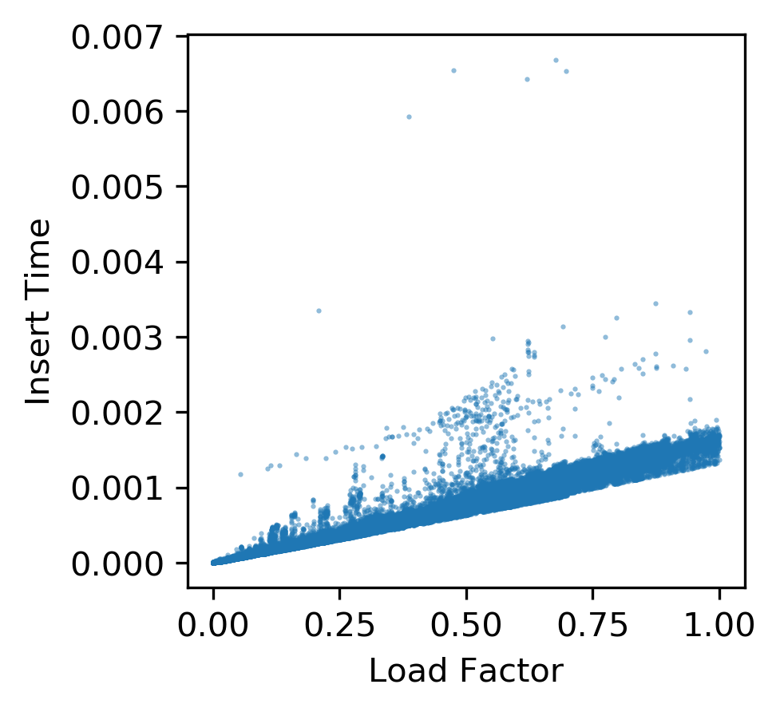
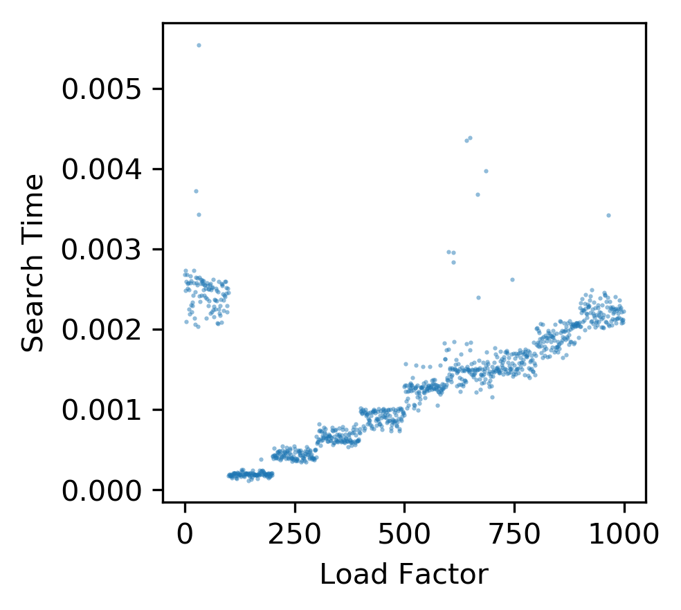
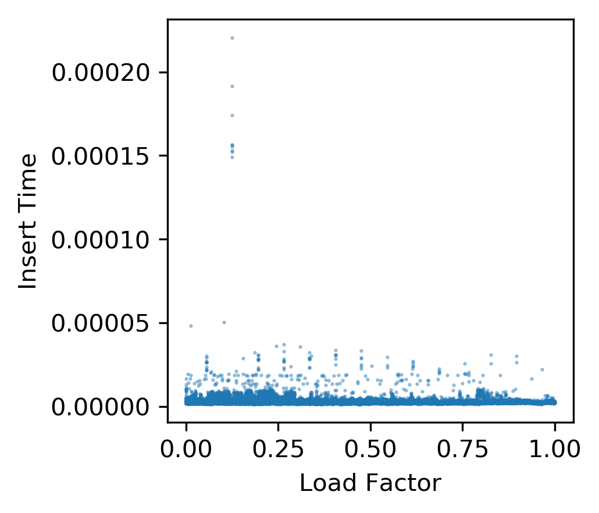
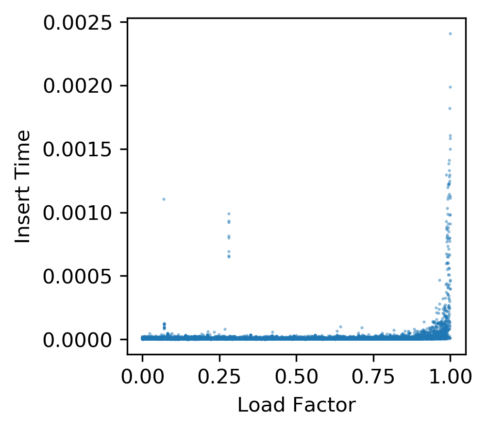
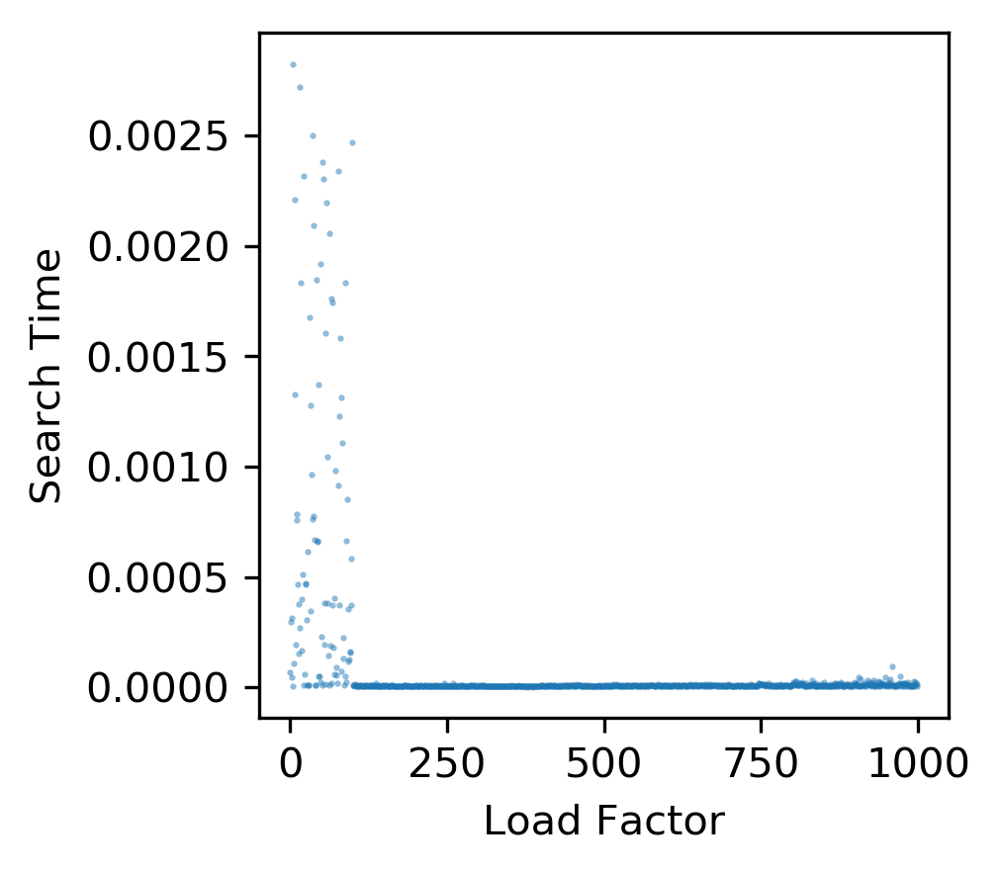
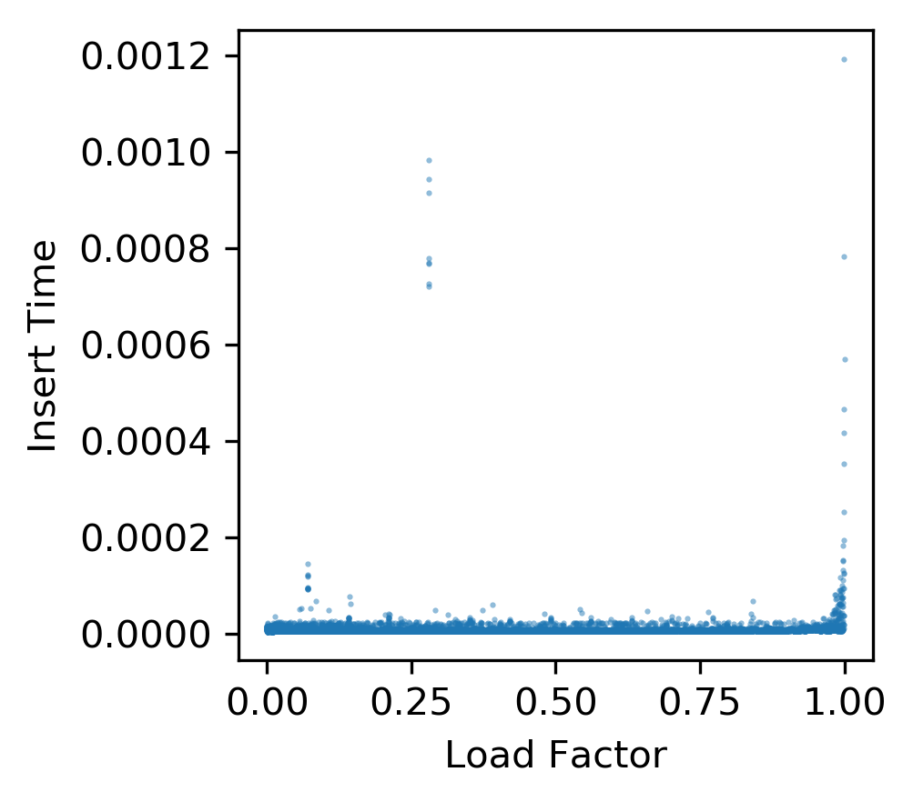
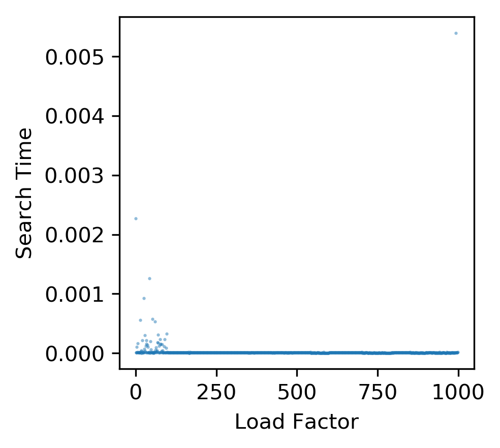
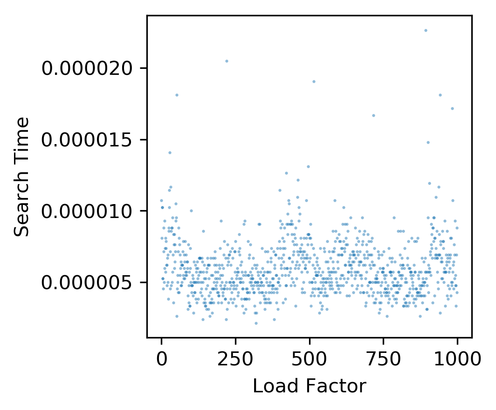
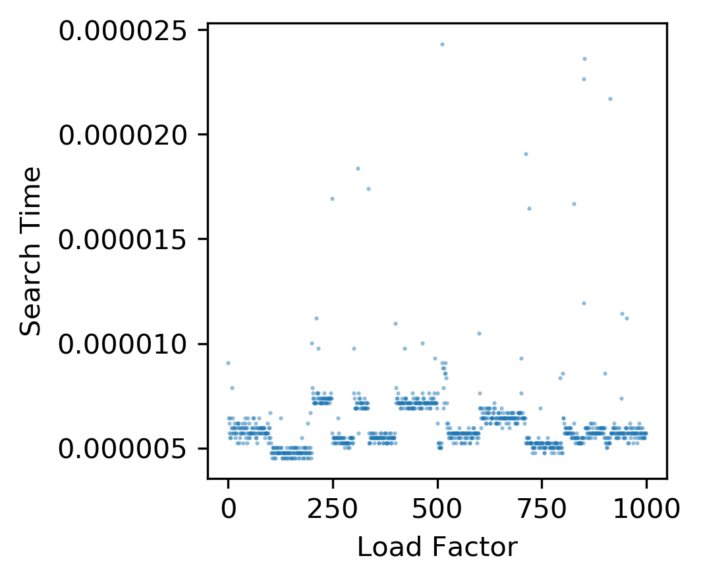

[](https://travis-ci.com/cu-swe4s-fall-2019/hash-tables-wehs7661)
# Hash tables
## Description
This is a repository for Assignment 6 of the course Software Engineering for Scientists (CSCI 7000) at CU Boulder, which includes the following files:
- `hash_functions.py`: A Python module of hash algorithms.
- `hash_tables.py`: A Python module of methods used in generating a hash table. 
- `test_hash.py`: A Python script containing the unit test functions for the methods used in `hash_functions.py` and `test_tables.py`.
- `rand_words.txt`: A text file of random words.
- `non_rand_words.txt`: A text file of non-random words.
- `scatter.py`: A Python script for generating a scatter plot from `STDIN`.
- `hash_table_plots.sh`: A shell script for generating scatter plots of hash tables with different input parameters. 
## Installation
All the Python scripts are written in Python 3 and the packages required to run the codes include: `argparse`, `sys`, `matplotlib`, `time`, `os`, `random` and `unittest`.
## Usage
### 1. Scatter plots of hash functions
`hash_functions.py` includes three different hash algorithm, including `h_ascii`, `h_rolling` and `h_myown`, which implements the ASCII hash method, the polynomial rolling hash method, and my own hash method, respectively. Here, we have two different input files, including `rand_words.txt` and `non_rand_words.txt`. For the detailed usage of the methods, please refer to the docstring of the methods.
#### (1) Using `h_ascii` on `rand_words.txt` (Figure 1.)
```
python hash_functions.py -i rand_words.txt -m ascii | python scatter.py -o images/ascii_func_rand.png -x "Hashed word" -y "Hashed value"
```

#### (2) Using `h_ascii` on `non_rand_words.txt` (Figure 2.)
```
python hash_functions.py -i non_rand_words.txt -m ascii | python scatter.py -o images/ascii_func_non_rand.png -x "Hashed word" -y "Hashed value"
```

#### (3) Using `h_rolling` on `rand_words.txt` (Figure 3.)
```
python hash_functions.py -i rand_words.txt -m rolling | python scatter.py -o images/rolling_func_rand.png -x "Hashed word" -y "Hashed value"
```

#### (4) Using `h_rolling` on `non_rand_words.txt` (Figure 4.)
```
python hash_functions.py -i non_rand_words.txt -m rolling | python scatter.py -o images/rolling_func_non_rand.png -x "Hashed word" -y "Hashed value"
```

#### (5) Using `h_myown` on `rand_words.txt` (Figure 5.)
```
python hash_functions.py -i rand_words.txt -m myown | python scatter.py -o images/myown_func_rand.png -x "Hashed word" -y "Hashed value"
```

#### (6) Using `h_myown` on `non_rand_words.txt` (Figure 6.)
```
python hash_functions.py -i non_rand_words.txt -m myown | python scatter.py -o images/myown_func_non_rand.png -x "Hashed word" -y "Hashed value"
```

### 2. Scatter plots of hash tables
`hash_tables.py` includes two different collision resolution strategies, including `LP` (linear probing) and `CH` (chained hash). Here, we have two different input files, including `rand_words.txt` and `non_rand_words.txt`. For the detailed usage of the methods, please refer to the docstring of the methods. To generate the following plots at once, run `bash hash_table_plots.sh`. 
#### (1) Using `h_ascii` with linear probing appraoch on `rand_words.txt` (Figure 5. and 6.)


#### (2) Using `h_ascii` with linear probing appraoch on `non_rand_words.txt` (Figure 7. and 8.)


#### (3) Using `h_ascii` with chained hash appraoch on `rand_words.txt` (Figure 9. and 10.)


#### (4) Using `h_ascii` with chained hash appraoch on `non_rand_words.txt` (Figure 11. and 12.)


#### (5) Using `h_rolling` with linear probing approach on `rand_words.txt` (Figure 13. and 14.)


#### (6) Using `h_rolling` with linear probing approach on `non_rand_words.txt` (Figure 15. and 16.)


#### (7) Using `h_rolling` with chained hash approach on `rand_words.txt` (Figure 17. and 18.)


#### (8) Using `h_rolling` with chained hash approach on `rand_words.txt` (Figure 19. and 20.)


### Discussion
From the figures above, we can observe that
- `rand_words.txt` genernally generate a distribution that is more random than the one generated by `non_rand_words.txt`. This is especially apparently when using `h_ascii` with linear probing, since `h_ascii` is not a very good hash algorithm in terms of generating a random distribution.
- Comparing Figure 1. and 2. with Figure 3. and 4., we can easily tell that algorithm rolling hash method is better than the ascii hash method in terms of generating a random distribution, no matter the input file is `rand_words.txt` or `non_rand_words.txt`.
- From Figure 5. to Figure 12., we can see that with `h_ascii`, for lienar probing approach, the insert time and the search time are approximately proportional to the load factor, while the for the chained hash approach, the linearity between the insert/search time and the load factor seems much lower. Based on this observation, chained hash is the better collision resolution strategies among the two.
- On the other hand, from Figure 13. to Figure 20., we can see that with `h_rolling`, both collision resolution strategies lead to higher independence between the insert/search time. There is not a big difference in this relationship between the two different collision resolution strategies.
## Changes made upon the starter code of Assignment 6
- Developed codes for hash algorithm and collision resolution strategies in `hash_functions.py` and `hash_tables.py`.
- Developed `scatter.py` to generate a scatter plot from `STDIN`.
- Added `rand_words.txt` and `non_rand_words.txt`.
- Developed unit tests for all the methods in `hash_functions.py` and `hash_tables.py`, including `test_hash_ascii`, `test_hahs_rolling`, `test_linear_probing` and `test_chained_hash`.
- Developed functional tests for `hash_functions.py`, `hash_tables.py` and `scatter.py`.
- Performed a bunch of experiments on hash tables and hash functions as shown above. 
- Modified `.travis.yml` to pass TravisCI.
